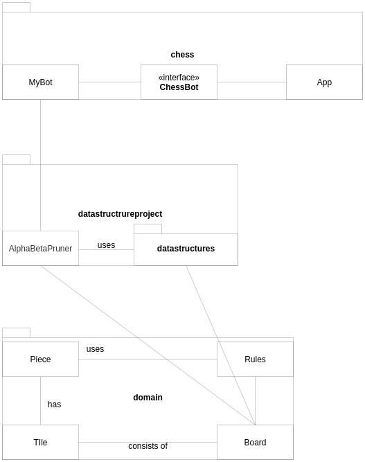

# Toteutusdokumentti

## Arkkitehtuuri


Tällä hetkellä nappulat perivät abstraktin luokan Piece. Jokaisella nappulalla, joka on laudalla on sijainti, Tile. Lauta muodostuu 
64 Tilesta. Board-luokka käy läpi jokaisen ruudun, tarkistaa, onko siinä nappulaa ja jos on, pyytää nappulan lailliset siirrot. 
Sitten Board käyttää Rules-luokan metodia ja tarkistaa, mitkä metodit eivät johda shakkiin. Nämä ovat tietyn puolen lailliset siirrot, 
jotka Board välittää algoritmille. Algoritmi valitsee näistä parhaan, kääntää sen tekstimuotoon ja välittää MyBotille, joka ChessBot- 
rajapinnan avulla antaa sen Appille, joka huolehtii siirron välittämisestä käyttöliittymäohjelmalle. 

## Saavutetut aika- ja tilavaativuudet

Algoritmin pseudokoodi:

```
public String useAlphaBetaPruner(Side side) {
  bestMove is null
  for each tile 
    start = tile
    for each tile2 in possibleMoves.get(start)
      finish = tile 
      nextMove = search(start, finish, depth, -inf, inf, otherSide)
      
      if nextMove is as good as previous 
        generate random and change or keep old
      if nextMove is better than previous
        change
        
  make bestMove
  return converted bestMove
}

public int search(start, finish, depth, alpha, beta, side) {
  if depth = 0 or node is terminal node
    reutrn board value
  board.move(start, finish)
  get possible moves 
  currentValue = worst possible
  for each tile 
    newStart = tile
    for each tile2 from possibleMoves.get(newStart)
      newFinish = tile2
      
      newValue = search(newStart, newFinish, depth-1, alpha, beta, otherSide)
      currentValue = better(newValue, currentValue)
      if cannot improve 
        break
        
  board situation back to previous
  return currentValue
}
```

Huonoin tilanne aikavaativuuden kannalta alfa-beta-karsinnassa on jos mitään ei voida karsia ja jokainen seuraava siirto voi parantaa edellistä, 
joten koko puu käydään läpi. Tällöin aikavaativuus on sama kuin Minimaxilla, eli O(p^k), missä p on solmun keskiverto lasten määrä ja k on puun korkeus. 

Paras tilanne on kuitenkin se, että käymme solmut läpi parhaimmasta huonoimpaan, jolloin voimme joka toisella tasolla tutkia yhden solmun ja joka toisella 
tasolla p solmua. Tällöin aikavaativuus on O(p^(k/2)). 

## Huomioita

Algoritmiin on pyritty luomaan satunnaisuutta. Aina kun algoritmi kohtaa sirron, joka on yhtä hyvä kuin 
nykyinen paras siirto, se generoi satunnaisen luvun väliltä 0-10, ja jos luku on pienempi kuin 5, se vaihtaa parhaan siirron 
uuteen. Muussa tapauksessa se pitää vanhan siirron ennallaan. 

## Parannusehdotuksia

Shakkipelissä botille jäi toteuttamatta tornitus ja sotilaiden korottaminen. Koska pelissä on kuitenkin valmis käyttöliittymä, 
ohjelmaan oli lisättävä ehdot vastustajan tornituksen ja korottamisen tarkistukselle. Ihminen voi siis pelatessaan tornittaa ja 
korottaa sotilaitaan ilman että botin toiminta häiriintyy, mutta botti ei koskaan itse tornita, ja jos botin sotilas pääsee laudan 
toiselle reunalle ja muuttuu kuningattareksi, botti ei liikuta sitä, koska luulee sen edlleen olevan sotilas. XBoard huolehtii siitä, 
että ihminen ei voi liikuttaa esim. kuningastaan niin, että tulee shakki, joten vaikka botti ei tiedä, että sotilas on kuningatar, 
se ei häiritse peliä. Jos taas botti pelaa itseään vastaan, ja esimerkiksi valkoisen puolen sotilas korotetaan, mustan pitäisi huomata 
tämä ennen seuraavaa siirtoaan ja päivittää pelitilanne. Nämä puutteet eivät siis varsinaisesti häiritse ydintoiminnallisuutta, 
mutta kuitenkin haittaavat botin päätöksentekoa (etenkin se, että botilla ei ole tietoa sotilaiden korottamisesta).

Botti voi pelata myös itseään vastaan, kuten määrittelydokumentissa on kirjoitettu. Ongelmana on vain se, että botti jumittuu hyvin usein. 
Syynä lienee se, että botin arvio pelitilanteesta perustuu puhtaasti laudalla olevien nappuloiden yhteisarvoon (nappuloiden keskinäiset 
arvot otettu freeCodeCampin sivuilta). Tämän takia jos kummallakin puolella on vain yksi siirto, joka ei johda tietyllä hakusyvyydellä 
minkään oman nappulan menetykseen, botti valitsee aina sen. Jos kummallakaan puolella tämä siirto ei lisää mahdollisia siirtoja, molemmat 
puolet siirtävät kyseisiä nappuloita vuorotellen edestakaisin. Ratkaisuna tähän voisi olla paranneltu tapa arvoida pelitilannetta, joka 
ottaisi huomioon myös nappuloiden sijainnit laudalla.

## Lähteet 

[freeCodeCamp](https://www.freecodecamp.org/news/simple-chess-ai-step-by-step-1d55a9266977/)

[Minimax - Wikipedia](https://en.wikipedia.org/wiki/Minimax)

[Minimax - Javatpoint](https://www.javatpoint.com/mini-max-algorithm-in-ai)

[Alpha-Beta-pruning - Wikipedia](https://en.wikipedia.org/wiki/Alpha%E2%80%93beta_pruning)
